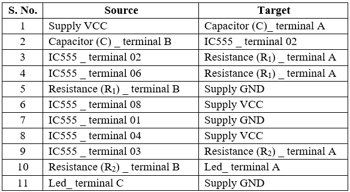

1.  Click on the **Components** button to place components on the table.

&emsp; &emsp; &emsp; ")&emsp; ")&emsp; ")&emsp;   

**Fig. 1 Components** 

  
2.  Make connections as per the circuit diagram and pin diagram of IC or according to connection table.

  

**Fig. 2 Circuit Diagram of Delay Before Turn On Timer**

  

**Fig. 3 Pin Diagram of 555 Timer IC** 

**Table 1: Connection table**

 

3.  Click on **Check Connections** button. If connections are right, click on **‘OK’**, then **Simulation** will become active.
4.  Observe the **Delay Time** before the circuit turns on (LED glows).
5.  Compare it with the theoretical value.
6.  Click on the **Reset** button to reset the page.

