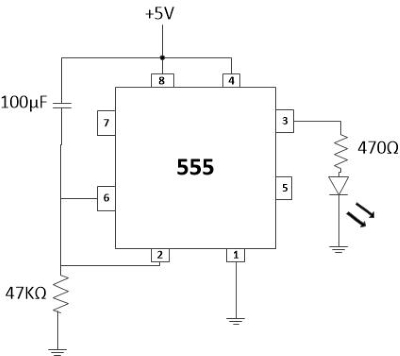

### Introduction

In many applications, a delay of a few seconds or minutes becomes a crucial requirement for ensuring correct operation of the circuit. Without the specified delay the circuit could malfunction or even get damaged. Electronic timing circuits provide this function reliably and accurately without any user input or monitoring once the time has been set. A timer is a control device that outputs a signal at a preset time after an input signal is received.

Timing circuits are used in a wide variety of applications from short time delays of a few nanoseconds used in digital circuitry and computers to long periods of hours used to control household appliances and industrial processes. RC networks are the basic circuit elements controlling timing circuits. The capacitor charges or discharges at a rate determined by the size of the capacitor and the size of the resistor.  

The operating mode determines the output method that is used when the set time has reached. On- and off-delay operating modes are the most commonly used. Other types include interval-on-operate, flasher, and repeat cycle timers.

A timer is a control device that outputs a signal at a preset time after an input signal is received. The operating mode determines the output method i.e used when the set time has reached. 'On' and 'Off' delay operating modes are the most commonly used. Other types include interval-on-operate, flasher and repeat cycle timers.

### **On-delay timers**

Normally open, on-delay timers start timing when the input voltage (power) is applied. The output is energized at the end of the delay. Input voltage has to be removed to de-energize the output and reset the time delay relay. On-delay operation has been shown in Fig. 1.

  

**Fig. 1 ON-delay operation** 

  

Also referred to as delay-on operate timers, they are often used for the following functions :-

*   Pushbutton signals- When the pedestrian pushbutton is pressed for a traffic signal, the signal light changes from red to green after a delay.
*   Blower motors to delay the operation for a specific time period after a gas, electric or oil heater has been turned on.
*   Stagger starting times for multiple compressors or motors that are activated by the main switch. This avoids excessive surge current in the power line.
*   Burglar and intrusion alarms.
*   Open door warnings.
*   Power supply sequencing.
*   Oven igniter controls
*   Fan controls.

### **Off-delay timers**

Off-delay timers are ready to accept the trigger when the input voltage is applied. An output is energized by applying the trigger, which must be removed for the time delay to start. An output is de-energized at the end of the time delay period. If the trigger is applied during the delay, it will reset. An Off-delay timer operation has been shown in Fig. 2.

  

**Fig. 2 Off-delay operation** 

  

Off-delay timers can be used in following functions :-

*   Car ceiling lights- When you get in your car, the ceiling light turns ON when the door is opened. The light remains lit for several seconds after you get into the car and close the door.
*   Air conditioning systems to hold the blower motor in operation for a specific time period after the thermostat has turned the cooling compressor off.
*   Operate electrical devices and motors for a specified time such as coin operated dryers in commercial laundries.
*   Gas valve controls.
*   Telephone circuit control.
*   Elevator door control.

### **Interval-on-operate**

Also referred as one-shot timers. The output for interval-on timers is already energized and the time delay starts when the input voltage is applied. The output is de-energized once the delay period is over. The input voltage has to be removed so that the time delay relay can be reset. An interval operation of delay timer has been shown in Fig. 3.  

**Fig. 3 Interval operation** 

  

Interval-on time delay relays may be used for followinf functions :-

*   Amusement park rides- The ride operates for a fixed time when a certain amount of money inserted.
*   A range of general purpose and demanding industrial and commercial applications.
*   Burglar alarm systems.
*   Electric welding machines.
*   Automotive seat belt warnings.
*   Dispensing equipment.
*   Pump stations.

### **Flashers**

When an input voltage is applied to a flasher, the contacts energize and de-energize after one another. The on-cycle and off-cycle times are of the same lengths. The timer is reset by removing the voltage and then reapplying it. Flasher operation of timer has been shown in Fig. 4.  
 

**Fig. 4 Flasher operation** 

  

Flasher timers are commonly used with following systems :-

*   Automatic control of fountains- The water is repeatedly released and stopped at perticular intervalss.
*   Alarm systems.
*   Indicator lights.
*   Warning light systems.

### **Repeat Cycle**

Repeat cycle timers have two controls so that cycles are independently adjustable. These cycles will continually repeat as long as the voltage is applied to the time delay relay. Some repeat cycle timers start the Off-timer first while others begin with the On-timer. For example, they may be used in conjunction with one another to make lamps flash on and off.  
The 555 Timer IC can be configured as timer with timing interval ranging from a few microseconds to many hours by wiring it with resistors and capacitors externally in various ways. It can be operated in different modes.  

1.  **Monostable Mode** is great for creating time delays. In this mode an external trigger causes the 555 timer to output a pulse of an adjustable duration.
2.  **Astable Mode** outputs an oscillating pulse signal/waveform. In this mode the output of the 555 timer switches between high and low states at a tunable frequency and pulse width. In the images 555 oscillator circuit if the timing capacitor is replaced with a large value electrolytic capacitor, for example, 220μF, 470μF; then by selecting the appropriate timing resistor or resistors the frequency of oscillation can be reduced to less than 1Hz. If this is the case the 555 circuit stops becoming an oscillator and becomes a timer or delay circuit.

### **555 timer IC**

555 timer IC is a highly stable integrated circuit. It can function as an accurate time delay generator and free running multivibrator as well. When it is used as an oscillator, its frequency and duty cycle can be accurately adjusted with the help of external components like resistors and capacitors. The IC also has the facility to trigger and reset on the falling edges of waveforms. Its salient features are as follows :-  

1.  It can provide timing from microseconds to hours.
2.  It can work on wide range of supply voltages from 3 V to 18 V DC.
3.  Its output is compatible with CMOS, DTL and TTL logics.
4.  It can provide high current sink or source output of 200mA.
5.  It has a separate trigger and reset input terminals.
6.  Its output can be operated as normal ON and normal OFF conditions.
7.  It has high temperature stability.

### **Pin Configuration of 555 Timer IC**

The pin configuration of 555 Timer IC has been shown in fig. 5.  

**Fig. 5 Pin Configuration of 555 Timer IC** 

  

1.  Pin 1- It is the ground pin of the IC.
2.  Pin 2- It triggers i.e. starts the timing cycle of the IC. When it receives 1/3rd of battery voltage for a short time, it triggers the IC. When IC is triggered, its output becomes HIGH and Pin 7 becomes OFF.
3.  Pin 3- This is the output pin of the IC. It can SINK or SOURCE a maximum current of 200mA.
4.  Pin 4- It resets the timing cycle of the IC. This pin must be connected to positive terminal of battery.
5.  Pin 5- This pin is called control voltage pin. We can apply variable voltage like triangular wave to this pin to modulate the output waveform of the IC. This pin is useful in some applications of modulation.
6.  Pin 6- It is the threshold pin. When it receives 2/3rd of battery voltage, it stops the timing cycle of the IC. When timing cycle stops, output of the IC becomes LOW and Pin 7 turns ON.
7.  Pin 7- It is the discharge pin. It discharges external capacitor (known as timing capacitor) into it.
8.  Pin 8- It is the positive supply pin. The supply voltage range of the IC is 3 V to 18 V DC.

### **Working**

The circuit diagram of On-delay timer using astable mode of 555 Timer IC is shown in fig. 6. Once power is applied to the circuit, it doesn't turn on the output right away. There is a delay of few seconds before the output turns on. We achieve the delay effect through the use of a capacitor. Basically the capacitor takes time to charge up. This time is what creates the delay.  
 
 

  

**Fig. 6 Circuit diagram of delay before turn on circuit** 

  

The circuit works through the RC network. The combination of the resistor and capacitor forms the RC network. This network determines the length of time it takes to charge the capacitor.  
The reason why the circuit doesn't turn on automatically is because of pin 2, the trigger pin, initially when the power turns on, is HIGH. Initially when the power turns On. Pin 2 is HIGH. This is because the capacitor hasn't charged up yet. Until the capacitor charges up, this pin is HIGH. Since the trigger pin is active LOW, the output will be off until this pin goes LOW. As the capacitor charges up and gets near the supply voltage it is connected to pin 2, the voltage at pin 2 decreases. When the voltage at pin 2 gets below 1/3rd of the supply voltage, the pin is now LOW. When it is LOW, this is when the output goes HIGH and the LED turns on.  
The time delay period in which the output is HIGH is given as: 2(0.693) RC in seconds, where R is in Ohms and C is in Farads.  
Time period (T) = 2(0.693) R × C  
R= 47 KΩ  
C = 100 μF  
Therefore, T= 2×0.693×47×103×100×10-6 sec  
T= 6.5 Sec  
Hence, there is a delay of about 6.5 seconds with this circuit. Once we turn the power on, the LED doesn't turn on until about after 6.5 seconds.

