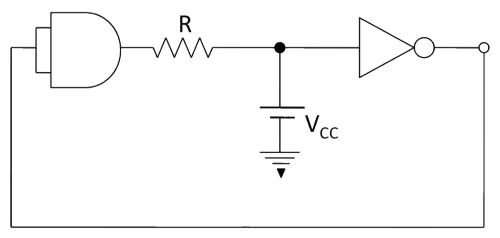
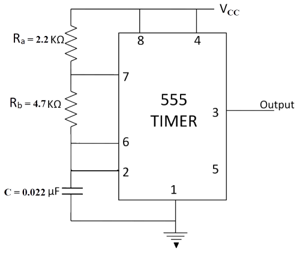

## Post test
#### Please attempt the following questions

Q1. Delay takes place due to the _____________ of capacitor. 
 
<b>A      Charging</b>         
B      Discharging           
 
  

Q2. Delay effect is achieved through the use of

A     Resistor  
B     Transistor  
C     Clock  
<b>D     Capacitor</b>  
 
  

Q3. Delay in circuit will become longer when

<b>A     Both resistor and capacitor values are big</b>  
B     Both resistor and capacitor values are small  
C     Capacitor has big value and resistor has small value  
D     Capacitor has small value and resistor has big value  
 
  

Q4. Using provided components in this experiment, we obtain delay of

A     5 sec.  
B     6 sec.  
<b>C     7 sec.</b>  
D     8 sec.  
 
  

Q5. If a low to high propagation delay is 1s and high to low propagation delay is 3s then total propagation delay will be

<b>A     2s</b>  
B     3s  
C     4s  
D     5s  
 
  

Q6. The operating mode of 555 timer IC in this experiment to obtain a Delay Before Turn On Circuit the circuit is

<b>A     Astable mode</b>  
B     Monostable mode  
C     Bistable mode  
D     None of these  
 
  

Q7. The circuit shown below acts as an

<b>A     Astable multivibrator</b>  
B     Monostable multivibrator  
C     Bistable multivibrator  
D     Sweep generator    
 
  

Q8. The output of a Astable circuit is

A     Low until a triggered is received  
<b>B     Constantly switches between two states</b>  
C     Floats until triggered  
D     High until a triggered is received    
 
  

Q9. The reset pin of IC 555 is normally connected to 

<b>A     Vcc</b>  
B     Ground   
C     Trigger  
D     Threshold   
 
  

Q10. In the astable multivibrator circuit shown in the figure, the frequency of oscillation (in KHz) at the output pin 3 is

  

<b>A     5.55 - 5.75</b>  
B     5.00 - 5.25  
C     5.25 - 5.50  
D     5.80 - 6.00  
